# 🎰✝️ The Casino and The Church  

*A 2D pixel-style web game exploring the paradox of crypto and Web3.*  

---

## 📖 Backstory  

Most believe crypto is one thing. They are wrong.

It is two.  

On one side lies **The Casino** — flashing lights, spinning wheels, memecoin madness. Fortunes made, fortunes lost. A place where hope is pumped like oxygen, where laughter echoes alongside the sound of collapsing dreams. It is exhilarating, unpredictable, intoxicating.  

On the other side stands **The Church** — a hall of sermons, prophecy, and belief. Here, old texts are rewritten as whitepapers. Here, the faithful argue over visions of tomorrow, promising freedom and salvation through code. It is solemn, righteous, inspiring.  

But here is the truth:  
The Casino funds the Church.  
The Church built the Casino.  
Neither can live without the other.  

You are a wanderer between these realms.  
In the Casino, your **LUCK** will rise and fall as you play.  
In the Church, your **FAITH** will grow through writing, quests, and prophecy.  

But beware—if you spend too long in one realm, the other will fade.  
Too much gambling, and your faith begins to crumble.  
Too much preaching, and your luck runs dry.  

Balance is survival.  
LUCK fuels FAITH.  
FAITH shapes LUCK.  
Together, they decide your fate.  

Welcome to **The Casino and The Church**.  

---

## 🎮 Gameplay Overview  

The game is divided into two realms:  

### 🎰 The Casino Realm  
- **Slot Machines** – Spin for points/coins.  
- **Memecoin Simulator** – Experience the highs and lows of trading.  
- **LUCK Progress Bar** – Increases when you win, decreases when you lose.  

### ✝️ The Church Realm  
- **Write Sermons** – Choose from crypto topics and create sermons to raise **FAITH**.  
- **Prophecy Quests** – Complete tasks that strengthen your **FAITH** bar.  
- **Coin Costs** – Every church activity consumes coins earned in the Casino.  

### ⚖️ Balance System  
- Spending too much time in one realm decreases the other’s progress bar.  
- **LUCK** and **FAITH** are interdependent:  
  - High FAITH increases your odds at the Casino.  
  - High LUCK provides more resources to fuel FAITH.  

---

## 🕹️ Game Loop  

1. **Enter the Casino** – Play games, earn coins, raise LUCK.  
2. **Visit the Church** – Spend coins, complete quests, grow FAITH.  
3. **Balance Both** – Avoid extremes. Neglecting one realm weakens the other.  
4. **Progression** – Strive for harmony between **LUCK** and **FAITH** to unlock deeper game content.  

---

## Architectural Diagram.

```mermaid
flowchart TB
    subgraph External["🌐 External Services & Infrastructure"]
        direction TB
        SOLANA["🔷 Solana Blockchain<br/>Runtime & Consensus"]
        SWITCHBOARD["🎲 Switchboard VRF<br/>Verifiable Randomness"]
        SPL_TOKEN["🪙 SPL Token Program<br/>USDC Mint & Transfers"]
    end

    subgraph Program["📦 Casino & Church Program<br/>(Anchor Program)"]
        direction TB
        
        subgraph CasinoModule["🎰 CASINO MODULE"]
            direction TB
            
            subgraph CasinoState["Casino State Management"]
                CASINO_STATE["`**CasinoState PDA**<br/>• Authority<br/>• Casino Vault<br/>• Total Games Played<br/>• Total Volume<br/>• House Edge Config<br/>• RTP Settings`"]
                CASINO_VAULT["`**Casino Vault (ATA)**<br/>USDC Token Account<br/>Holds player bets`"]
                USER_STATS["`**UserStats PDA**<br/>• Total Bets<br/>• Total Wins/Losses<br/>• Loyalty Points<br/>• Games Played`"]
            end
            
            subgraph VRFFlow["VRF-Based Game Flow"]
                direction LR
                GAME_REQUEST["`**request_slots_game()**<br/>request_roulette_game()`"]
                VRF_STATE["`**VrfGameState PDA**<br/>• Game Type<br/>• Bet Amount<br/>• Randomness Account<br/>• Commit Slot<br/>• Game Phase`"]
                VRF_REVEAL["`**settle_slots_game()**<br/>settle_roulette_game()`"]
                PAYOUT_CALC["`**Payout Calculation**<br/>• Calculate Win/Loss<br/>• Apply House Edge<br/>• Apply RTP Multiplier`"]
                TOKEN_TRANSFER["`**Token Transfer**<br/>Winner → User ATA<br/>Loser → Casino Vault`"]
                
                GAME_REQUEST -->|"1. Commit Randomness<br/>Transfer Bet to Vault"| VRF_STATE
                VRF_STATE -->|"2. Wait for Reveal"| VRF_REVEAL
                VRF_REVEAL -->|"3. Get Random Number"| PAYOUT_CALC
                PAYOUT_CALC -->|"4. Transfer Payout"| TOKEN_TRANSFER
            end
            
            subgraph GameTypes["Game Implementations"]
                SLOTS["`**Slots Game**<br/>• 3 Reels (0-9)<br/>• Multiple Paylines<br/>• Symbol Matching<br/>• RTP: 95%`"]
                ROULETTE["`**Roulette Game**<br/>• European Style<br/>• Multiple Bet Types<br/>• Straight/Split/Street/etc<br/>• RTP: 97.3%`"]
                AVIATOR["`**Aviator Game**<br/>• Crash Multiplier<br/>• Cashout Timing<br/>• RTP: 96%`"]
                BLACKJACK["`**Blackjack Game**<br/>• Standard Rules<br/>• Hit/Stand/Double/Split<br/>• RTP: 99.5%`"]
            end
        end
        
        subgraph QuestModule["⛪ QUEST MODULE (THE CHURCH)"]
            direction TB
            
            QUEST_FACTORY["`**QuestFactory PDA**<br/>• Authority<br/>• Total Campaigns<br/>• Platform Fee BPS<br/>• Total Rewards Distributed`"]
            
            subgraph QuestFlow["Quest Campaign Lifecycle"]
                direction TB
                CREATE_QUEST["`**create_quest_campaign()**<br/>Project Creates Campaign`"]
                QUEST_CAMPAIGN["`**QuestCampaign PDA**<br/>• Creator<br/>• Title & Description<br/>• Quest Type<br/>• Reward Pool<br/>• Max Participants<br/>• Start/End Time<br/>• Completion Criteria`"]
                QUEST_VAULT["`**Quest Vault (ATA)**<br/>Holds Funded Rewards<br/>USDC Token Account`"]
                PARTICIPATE["`**participate_in_quest()**<br/>Player Joins Campaign`"]
                QUEST_PARTICIPATION["`**QuestParticipation PDA**<br/>• User<br/>• Campaign<br/>• Completion Status<br/>• Verification Data`"]
                COMPLETE["`**complete_quest()**<br/>Player Completes Requirements`"]
                DISTRIBUTE["`**distribute_quest_rewards()**<br/>Creator Distributes Rewards`"]
                QUEST_REWARDS["`**QuestRewards PDA**<br/>• Total Distributed<br/>• Participants Rewarded<br/>• Distribution Status`"]
                
                CREATE_QUEST -->|"Fund Campaign"| QUEST_VAULT
                CREATE_QUEST --> QUEST_CAMPAIGN
                PARTICIPATE --> QUEST_PARTICIPATION
                QUEST_PARTICIPATION --> COMPLETE
                COMPLETE --> DISTRIBUTE
                DISTRIBUTE --> QUEST_REWARDS
            end
            
            QUEST_TYPES["`**Quest Types**<br/>• Social (Follow, Retweet)<br/>• Technical (Test Protocols)<br/>• Creative (Content Creation)<br/>• Community (Join Discord)<br/>• Custom`"]
        end
        
        subgraph LiquidityModule["💰 LIQUIDITY MODULE"]
            direction TB
            
            LIQ_POOL["`**LiquidityPool PDA**<br/>• Authority<br/>• LP Token Mint<br/>• Total Liquidity<br/>• LP Token Supply<br/>• Platform Fee Share BPS<br/>• Staking Rewards APR`"]
            LP_VAULT["`**LP Vault (ATA)**<br/>USDC Deposits<br/>Token Account`"]
            LP_MINT["`**LP Token Mint**<br/>1:1 Ratio with USDC`"]
            
            subgraph LPFlow["LP Lifecycle"]
                direction TB
                DEPOSIT["`**deposit_liquidity()**<br/>LP Deposits USDC`"]
                MINT_LP["`**Mint LP Tokens**<br/>1 USDC = 1 LP Token`"]
                STAKE["`**stake_lp_tokens()**<br/>Lock LP Tokens`"]
                LP_STAKING["`**LPStaking PDA**<br/>• Staked Amount<br/>• Staking Period<br/>• Start/End Time<br/>• Rewards Earned`"]
                CLAIM["`**claim_lp_rewards()**<br/>Claim Staking Rewards`"]
                LP_USER_STATS["`**LPUserStats PDA**<br/>• Total LP Tokens<br/>• Total Staked<br/>• Rewards Claimed<br/>• Fees Earned`"]
                
                DEPOSIT --> MINT_LP
                MINT_LP --> STAKE
                STAKE --> LP_STAKING
                LP_STAKING --> CLAIM
                CLAIM --> LP_USER_STATS
            end
            
            subgraph FeeDistribution["Fee Distribution System"]
                direction TB
                PLATFORM_FEES["`**Platform Fees**<br/>2% from Casino Games`"]
                FEE_DIST["`**distribute_platform_fees()**<br/>Epoch-Based Distribution`"]
                FEE_DIST_ACC["`**FeeDistribution PDA**<br/>• Epoch<br/>• Total Fees<br/>• LP Share (30%)<br/>• Platform Share (70%)`"]
                LP_REWARDS["`**LP Rewards Pool**<br/>Distributed to Stakers`"]
                
                PLATFORM_FEES --> FEE_DIST
                FEE_DIST --> FEE_DIST_ACC
                FEE_DIST_ACC --> LP_REWARDS
            end
            
            STAKING_PERIODS["`**Staking Periods**<br/>• Short: 30 days (1x)<br/>• Medium: 90 days (1.5x)<br/>• Long: 180 days (2x)<br/>• Ultra: 365 days (3x)`"]
        end
    end
    
    subgraph Users["👥 User Interactions"]
        direction TB
        PLAYERS["`**Players**<br/>• Play Casino Games<br/>• Complete Quests<br/>• Earn Rewards`"]
        PROJECTS["`**Projects**<br/>• Create Quest Campaigns<br/>• Fund Rewards<br/>• Verify Completions`"]
        LPs["`**Liquidity Providers**<br/>• Deposit USDC<br/>• Stake LP Tokens<br/>• Earn Yields`"]
    end
    
    subgraph TokenFlow["💸 Token Flows"]
        direction LR
        USDC_MINT["`**USDC Mint**<br/>Native Token`"]
        USER_ATA["`**User Token Accounts**<br/>Player Wallets`"]
        CASINO_TOKENS["`**Casino → Vault**<br/>Bets & Payouts`"]
        QUEST_TOKENS["`**Quest → Vault → Users**<br/>Campaign Rewards`"]
        LP_TOKENS["`**LP → Vault → Stakers**<br/>Deposits & Rewards`"]
        
        USDC_MINT --> USER_ATA
        USER_ATA <--> CASINO_TOKENS
        USER_ATA <--> QUEST_TOKENS
        USER_ATA <--> LP_TOKENS
    end
    
    %% External Connections
    SOLANA --> Program
    SWITCHBOARD -->|"VRF Randomness<br/>Commit → Reveal"| VRFFlow
    SPL_TOKEN -->|"Token Operations"| Program
    SPL_TOKEN --> TokenFlow
    
    %% Module Connections
    CasinoModule -->|"Platform Fees (2%)"| FeeDistribution
    QuestModule -->|"Platform Fees"| QUEST_FACTORY
    LiquidityModule -->|"LP Fee Share (30%)"| LP_REWARDS
    
    %% User Interactions
    Users --> CasinoModule
    Users --> QuestModule
    Users --> LiquidityModule
    
    %% Styling
    classDef casinoStyle fill:#ff6b6b,stroke:#c92a2a,stroke-width:2px,color:#fff
    classDef questStyle fill:#4dabf7,stroke:#1971c2,stroke-width:2px,color:#fff
    classDef liquidityStyle fill:#51cf66,stroke:#2f9e44,stroke-width:2px,color:#fff
    classDef externalStyle fill:#868e96,stroke:#495057,stroke-width:2px,color:#fff
    classDef programStyle fill:#845ef7,stroke:#5f3dc4,stroke-width:3px,color:#fff
    
    class CasinoModule,VRFFlow,GameTypes,CASINO_STATE,CASINO_VAULT,USER_STATS casinoStyle
    class QuestModule,QuestFlow,QUEST_FACTORY,QUEST_CAMPAIGN,QUEST_VAULT questStyle
    class LiquidityModule,LPFlow,FeeDistribution,LIQ_POOL,LP_VAULT liquidityStyle
    class SOLANA,SWITCHBOARD,SPL_TOKEN externalStyle
    class Program programStyle
```



## 🚀 Installation & Setup  

### Prerequisites  
- [Node.js](https://nodejs.org/) (>= 18.x recommended)  
- [npm](https://www.npmjs.com/) or [yarn](https://yarnpkg.com/)  

### Steps  

```bash
# Clone the repository
git clone https://github.com/tsmboa0/the-casino-and-the-church.git

# Navigate into the project folder
cd the-casino-and-the-church

# Install dependencies
npm install
# or
yarn install

# Start development server
npm run dev
# or
yarn dev
